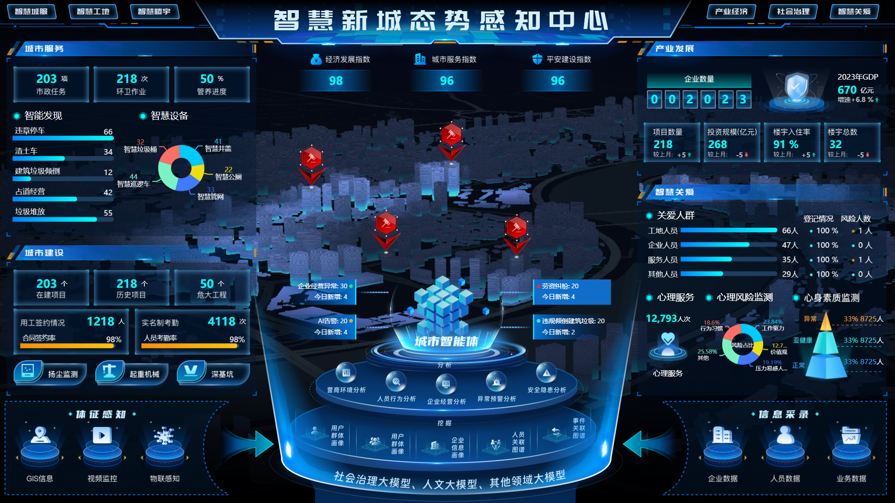

# 智慧新城态势感知中心

公众号：程云说

B站：刘程云

CSDN：刘程云

## 项目背景

 随着智慧城市建设的不断深入，对城市运行状态的实时监控和态势感知变得尤为重要。为此，我们开发了“智慧新城态势感知中心”项目，旨在通过集成多源数据，利用先进的数据分析技术和可视化手段，为城市管理者提供全面、实时、高效的态势感知服务。 

## 项目目标

 本项目旨在构建一个集数据收集、整合、分析、可视化于一体的综合态势感知平台，实现对城市运行状态的全面监控和预测分析，为城市管理提供决策支持。 

## 技术栈

本项目基于Vue3框架进行开发，Vue3以其高性能、易扩展、组件化开发等特点，为项目的快速开发和维护提供了有力支持。同时，项目还采用了以下技术栈：

- Vue3：作为项目的核心框架，提供了响应式数据绑定、组件化开发等特性。
- Vue Router：用于构建单页面应用的路由系统。
- Pinal：用于管理应用的状态，实现跨组件数据共享。
- Axios：用于发送HTTP请求，与后端进行数据交互。
- ECharts/D3.js：用于数据可视化，将复杂的数据以图表的形式直观地展现出来。
- CSS/SCSS/Less：用于样式编写，提升界面的美观度和用户体验。

## 总结

 智慧新城态势感知中心项目利用Vue3等先进技术栈，构建了一个全面、实时、高效的态势感知平台。通过集成多源数据、利用先进的数据分析技术和可视化手段，为城市管理者提供了有力的决策支持。 

## 效果图

